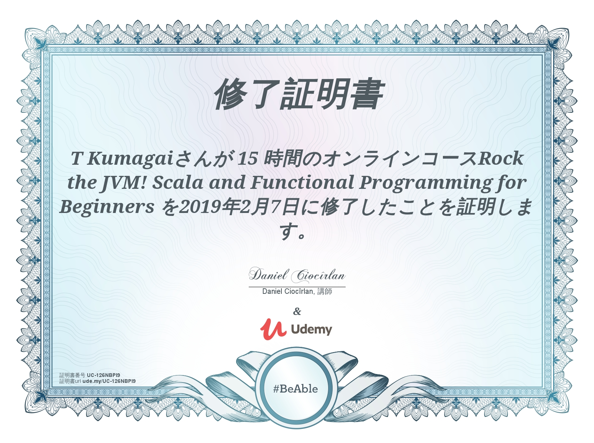

{:height="36px" width="36px"}
# Scala Beginner

## Udemy Site

<https://www.udemy.com/rock-the-jvm-scala-for-beginners>

## Udemy Cource
Rock The Scala For Beginners

Future Map

<pre>
<code>
val head = "Scala Advanced Cource".split(" ").toList.head
val power = {
 Seq(
   "Apache Spark",
   "AWS EMR",
   "AWS S3",
   "AWS DynamoDB"
 ).flatMap(v => Map(head -> v))
}.mkString
// ElasticsSearch -> Kibana -> ...
}
</code>
</pre>
<pre>
<code>
+ Scala Native
+ Scala JS
+ LLVM
+ etc 
</code>
</pre>

